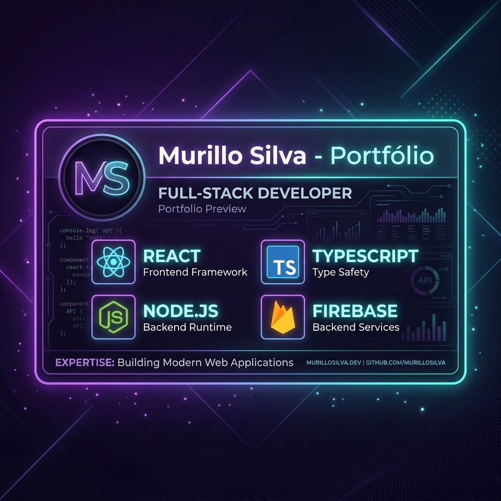

<div align="center">
  
  
  # 💻 Murillo Silva — Portfólio Full-Stack & Systems Showcase
  
  [](https://react.dev/)
  [](https://www.typescriptlang.org/)
  [](https://vitejs.dev/)
  [](https://tailwindcss.com/)
  
  **Um portfólio interativo, moderno e elegante que apresenta soluções full-stack, automações inteligentes e sistemas operacionais de alta performance.**
  
  [🌐 Acessar Portfólio](https://portifolio-murillo-silva.netlify.app/) • [📱 LinkedIn](https://www.linkedin.com/in/murillo-silva-dev/) • [✉️ Contato](#contato)
</div>

---

## 🚀 Sobre o Portfólio

Este projeto é a vitrine digital de **Murillo Silva**, Desenvolvedor Full-Stack com mais de **5 anos de experiência**. 

O portfólio não é apenas um site estático, mas uma aplicação interativa que conta com:
- **Assistente Virtual Inteligente (Robot Buddy)**: Um assistente interativo em tempo real que guia o usuário pelas seções e comenta sobre cada projeto utilizando a API do Gemini.
- **Visualização Dinâmica de Markdown**: Integração com as bibliotecas `marked` e `prismjs` para carregar e renderizar os arquivos de especificação técnica (`READMEs` detalhados) de cada sistema de forma elegante direto na tela.
- **Filtros Avançados**: Classificação rápida de projetos através de tags dinâmicas.
- **Design Premium**: Visual dark-mode imersivo com efeitos de spotlight, glassmorphism, e animações fluidas via `framer-motion` (Motion).
- **Acessibilidade e Usabilidade**: Suporte nativo a modo de alto contraste e componentes totalmente responsivos.

---

## 🛠️ Tecnologias do Portfólio

- **Core**: React 19, TypeScript, Vite
- **Estilização e Animação**: Tailwind CSS, Framer Motion (Motion), Lucide React (Ícones)
- **Leitura & Estilização de Código**: Marked (Markdown Parser), Prism.js (Syntax Highlighting)

---

## 🖥️ Os Sistemas em Destaque

O portfólio apresenta detalhadamente os seguintes sistemas desenvolvidos:

### 1. ⚙️ CHAMADOS LOC (Nexus Tickets)
*Sistema operacional inteligente de gerenciamento de chamados e suporte técnico.*
* **Tags**: `React 19`, `Firebase`, `Gemini AI`, `Node.js`
- **O que faz**: Otimiza e centraliza todo o fluxo de atendimento técnico e rotinas operacionais de equipes de TI ou manutenção.
- **Funcionalidades Principais**:
  - **Quadro Kanban Interativo** com funcionalidade *drag and drop* para controle do fluxo (Aberto, Em Andamento, Pendente, Resolvido).
  - **Assistência com Gemini AI** para categorização automática, definição de prioridades, refinamento de descrições e sugestão de respostas rápidas.
  - **Recorrências de Tarefas** para agendamento de chamados automáticos (preventivas).
  - **Notificações Multi-canal** via Push no navegador, e-mails pelo SendGrid e mensagens automáticas em canais corporativos do Slack.
  - **Gráficos e Indicadores (KPIs)** integrados via Recharts.

### 2. 📦 15-EJC Estoque
*Sistema moderno de inventário, controle de caixa e fluxo de mercadorias.*
* **Tags**: `React`, `Tailwind CSS`, `PWA`, `Local Database`
- **O que faz**: Criado especificamente para gerenciar o inventário e caixa da bomboniere do 15º Encontro de Jovens com Cristo (EJC).
- **Funcionalidades Principais**:
  - Cadastro, edição e controle de saldo rápido de produtos (+ / -).
  - Suporte a funcionamento **offline (PWA)** com persistência de dados local.
  - Integração com **Supabase** na nuvem para sincronização em tempo real quando há internet.
  - Painel de fluxo de caixa e exportação completa de movimentações em formato CSV.

### 3. 📝 Forms Portal Master (Pedidos Master)
*Portal automatizado para captação e gerenciamento de pedidos de dispositivos com geração de PDFs.*
* **Tags**: `JavaScript`, `Google Apps Script`, `Capacitor`, `HTML5`
- **O que faz**: Automatiza o processo de recebimento de novos pedidos de dispositivos rastreadores e bloqueadores.
- **Funcionalidades Principais**:
  - Formulário inteligente passo a passo com busca de CEP (ViaCEP) e máscaras para campos como CNPJ/Telefone.
  - Integração em nuvem com **Google Apps Script** rodando em background para preenchimento de planilhas.
  - Geração automática de documentos de pedido oficial em formato **PDF** e armazenamento organizado no Google Drive.
  - Disparo de e-mails transacionais com o PDF anexo para clientes e administradores.
  - Empacotado para plataformas mobile (Android) utilizando **Capacitor**.

### 4. 📺 Sistema Tela e TV
*Painel de controle e monitoramento em tempo real para frotas e televisores operacionais.*
* **Tags**: `React`, `Firebase`, `Tailwind CSS`, `Realtime`
- **O que faz**: Projetado para o acompanhamento dinâmico de locações, frotas de motocicletas e tickets de atendimento exibidos em telas corporativas.
- **Funcionalidades Principais**:
  - Acompanhamento de entregas e motociclistas em tempo real.
  - Painel operacional idealizado para transmissão em TVs de centros de monitoramento.
  - Atualizações instantâneas usando websockets e banco em tempo real (Firebase Realtime).

### 5. ⚡ WISE Engenharia
*Plataforma institucional moderna para serviços de engenharia e automação residencial/comercial.*
* **Tags**: `React`, `Tailwind CSS`, `Vite`, `Engineering`
- **O que faz**: Apresenta de forma moderna os serviços elétricos, luminotécnicos, SPDA e automação inteligente oferecidos pela WISE Engenharia em São Paulo.
- **Funcionalidades Principais**:
  - Landing page de altíssima performance, com carrossel dinâmico de portfólio de projetos executados.
  - Formulário de contato completo integrado para envio de e-mails diretos.
  - Assistente virtual automatizado com perguntas frequentes (FAQs) categorizadas.

### 6. 🧠 Tarefasia
*Gerenciador ágil de tarefas de produtividade potencializado por Inteligência Artificial.*
* **Tags**: `React`, `Gemini AI`, `Tailwind CSS`, `Firebase`
- **O que faz**: Otimiza rotinas e o planejamento de tarefas diárias e semanais usando inteligência artificial generativa.
- **Funcionalidades Principais**:
  - Planejamento semanal com estimativas e divisão inteligente de subtarefas auxiliadas pelo Gemini AI.
  - Geração de relatórios executivos de produtividade em PDF.
  - Autenticação de usuário segura usando login social com o Google.

---

## 💻 Como Rodar este Portfólio Localmente

### Pré-requisitos
- Node.js instalado (versão 18 ou superior recomendada)
- NPM ou Yarn

### Passo a Passo

1. **Clonar o Repositório:**
   ```bash
   git clone git@github.com:Murillooh/portifolio-murillo-silva.git
   cd portifolio-murillo-silva
   ```

2. **Instalar Dependências:**
   ```bash
   npm install
   ```

3. **Configuração de Variáveis de Ambiente (Opcional):**
   Crie um arquivo `.env.local` na raiz e insira sua chave da API do Gemini caso queira testar a inteligência do robô localmente:
   ```env
   VITE_GEMINI_API_KEY=sua_chave_aqui
   ```

4. **Executar em Modo de Desenvolvimento:**
   ```bash
   npm run dev
   ```
   Acesse no navegador: `http://localhost:3000`

5. **Build de Produção:**
   ```bash
   npm run build
   ```

---

## ✉️ Contato

- **LinkedIn:** [linkedin.com/in/murillo-silva-dev](https://www.linkedin.com/in/murillo-silva-dev/)
- **GitHub:** [github.com/Murillooh](https://github.com/Murillooh)
- **Localização:** São Paulo - SP, Brasil
